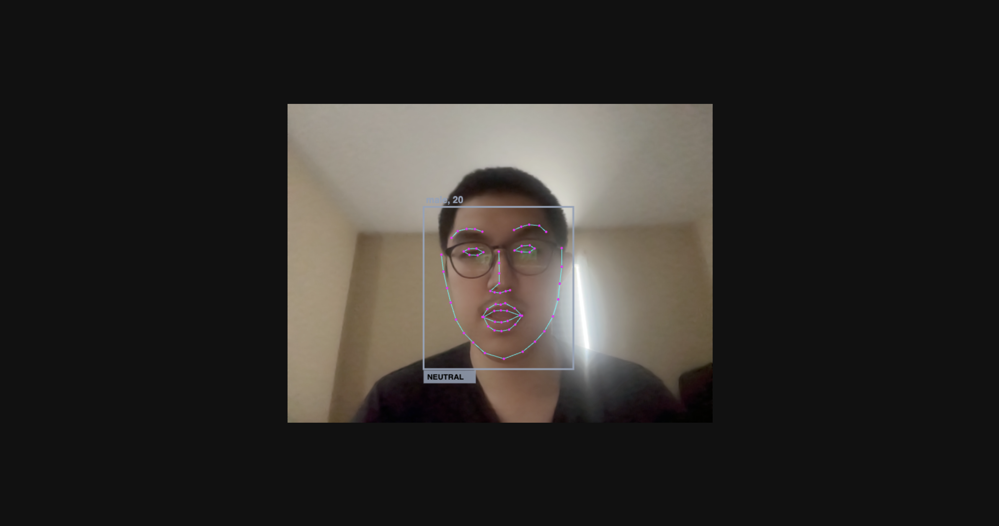

# Face Emotion Recognition

Real-time face detection in the browser — no server, no install, just open and go.



## What it does

- Detects your face live from webcam
- Shows your **dominant emotion** (happy, sad, angry, surprised, neutral…)
- Guesses your **age and gender**
- Color-coded box changes based on how you feel
- All runs locally in your browser — nothing leaves your device

## Emotion Gym

Interactive face game — mirror the displayed emotion before the timer runs out!

- Difficulty escalates across rounds (harder emotions + less time)
- 3 misses = Game Over
- Open `game.html` to play (or click the button from the live view)

[](https://youtu.be/s5G928_qQOM)

## How to run

```bash
# 1. Clone
git clone https://github.com/Lameda12/Face-Emotion-Recognition.git
cd Face-Emotion-Recognition

# 2. Serve locally (needs a server, not file://)
python3 -m http.server 8080

# 3. Open browser
http://localhost:8080
```

Allow camera access when prompted. That's it.

## Stack

- [face-api.js](https://github.com/justadudewhohacks/face-api.js) — face detection models
- Vanilla JS + HTML Canvas
- No frameworks, no backend

## Credits

Originally based on [arlanrakh/Face-Emotion-Recognition](https://github.com/arlanrakh/Face-Emotion-Recognition).  
Enhanced with loading UI, color-coded emotions, age & gender detection.
